# ERD and data-coverage guide

This guide describes the schema committed in `src/lib/database/schema.ts` and
the data coverage the application may truthfully claim. It is not a statement
that a table has been populated: at the time of this guide, no Formula 1 core
source data has been imported.

## Entity relationship diagram

```mermaid
erDiagram
  seasons ||--o{ races : contains
  countries ||--o{ circuits : hosts
  countries ||--o{ drivers : nationality
  countries ||--o{ constructors : nationality
  circuits ||--o{ circuit_configurations : has
  circuit_configurations ||--o{ races : used_by
  race_formats ||--o{ races : defines
  races ||--o{ sessions : contains
  session_types ||--o{ sessions : classifies

  drivers ||--o{ driver_aliases : has
  constructors ||--o{ constructor_aliases : has
  sessions ||--o{ race_results : classifies
  sessions ||--o{ qualifying_results : classifies
  sessions ||--o{ sprint_results : classifies
  sessions ||--o{ practice_results : classifies
  sessions ||--o{ lap_times : contains
  drivers ||--o{ race_results : competes
  drivers ||--o{ qualifying_results : competes
  drivers ||--o{ sprint_results : competes
  drivers ||--o{ practice_results : competes
  drivers ||--o{ lap_times : records
  constructors ||--o{ race_results : enters
  constructors ||--o{ qualifying_results : enters
  constructors ||--o{ sprint_results : enters
  constructors ||--o{ practice_results : enters
  status_codes ||--o{ race_results : explains
  status_codes ||--o{ qualifying_results : explains
  status_codes ||--o{ sprint_results : explains
  status_codes ||--o{ practice_results : explains
  tire_compounds ||--o{ lap_times : identifies

  sessions ||--o{ driver_standings : snapshot_after
  sessions ||--o{ constructor_standings : snapshot_after
  seasons ||--o{ driver_championship_results : finishes
  seasons ||--o{ constructor_championship_results : finishes
  drivers ||--o{ driver_standings : ranks
  drivers ||--o{ driver_championship_results : ranks
  constructors ||--o{ constructor_standings : ranks
  constructors ||--o{ constructor_championship_results : ranks

  import_runs ||--o{ race_results : records
  import_runs ||--o{ qualifying_results : records
  import_runs ||--o{ sprint_results : records
  import_runs ||--o{ practice_results : records
  import_runs ||--o{ lap_times : records
  import_runs ||--o{ driver_standings : records
  import_runs ||--o{ constructor_standings : records
  import_runs ||--o{ driver_championship_results : records
  import_runs ||--o{ constructor_championship_results : records
  import_runs ||--o{ news_articles : records
  news_sources ||--o{ news_articles : publishes
```

## Schema groups

| Group | Committed tables | Purpose |
| --- | --- | --- |
| Import audit | `import_runs` | Records a source, scope, status, timing, counts, and sanitized error details for an import attempt. |
| Reference data | `seasons`, `countries`, `circuits`, `circuit_configurations`, `drivers`, `driver_aliases`, `constructors`, `constructor_aliases`, `status_codes`, `points_systems`, `race_formats`, `session_types`, `tire_compounds` | Normalizes entities and historic rule/format variations. |
| Race weekends | `races`, `sessions` | Separates a championship event from each independently scheduled session. |
| Classifications | `race_results`, `qualifying_results`, `sprint_results`, `practice_results` | Preserves grid, classification, timing, points, driver, constructor, status, and provenance fields appropriate to each session type. |
| Championship results | `driver_standings`, `constructor_standings`, `driver_championship_results`, `constructor_championship_results` | Stores post-scoring-session snapshots separately from final seasonal classifications. |
| Detailed timing | `lap_times` | Stores per-driver, per-lap timing, sector, stint, tire, pit, deletion, accuracy, and provenance data. |
| News metadata | `news_sources`, `news_articles` | Stores attributed article metadata and freshness; complete article bodies are intentionally excluded. |

All import-backed result, standing, championship-result, and lap-time records
have an optional paired `source`/`source_identifier` and an `import_run_id`.
Database constraints prevent a source field being recorded without its matching
identifier, and unique indexes prevent duplicate source records where the
schema requires it.

## Coverage and availability rules

| Data area | Intended coverage | Current repository state | What the UI must say before a verified import |
| --- | --- | --- | --- |
| Core championship data | 1950–2026 | Schema exists; importer and data backfill are not implemented. | `Not imported` or `Unavailable`; never show an empty result as a zero-result season. |
| Qualifying, race, sprint, and standings | Historical where supplied by the core source | Tables and migration tests exist; no source data is loaded. | `Not imported` or `Unavailable`. |
| Practice and lap timing | 2018+ only where session coverage is verified | `practice_results` and `lap_times` tables exist; no FastF1 worker or data is present. | `Unavailable` for unverified/older coverage and `Not imported` for unchecked eligible sessions. |
| Lap positions, pit stops, tire stints | 2018+ where verified | Not yet modeled in the committed schema. | Do not expose the feature as available. |
| News metadata | Configured-provider results only | Importer, normalized tables, and tests exist; imported records depend on local credentials and a successful run. | Empty/stale/error state with the last successful refresh when that read model exists. |

Use these terms consistently:

- **Verified:** an import and its validation completed successfully for the
  stated table, season, and session.
- **Unavailable:** the data was checked and is absent, unsupported, or outside
  the supported coverage period.
- **Not imported:** the applicable data source or session has not been
  processed yet.
- **Incomplete:** some expected records are missing or a validation failed;
  do not present aggregates as final.

## Correction procedure

1. Record the source, source identifier, affected table/season/session, reason,
   and review date before applying a correction.
2. Run the relevant importer as a new `import_runs` entry. Preserve the source
   identifier and capture success, failure, counts, duration, and sanitized
   error details.
3. Use the table's natural and source-record uniqueness constraints to update
   the current normalized record rather than create an accidental duplicate.
4. Re-run the applicable rounds, results, points, standings, and coverage
   validations. Mark the data **Incomplete** until those checks pass.
5. Publish the corrected freshness/coverage status to readers. Do not imply
   that historic detail is complete merely because a correction was attempted.

The committed schema provides import-run and source-record provenance fields,
but a full append-only correction-history implementation is still future work.
Until that workflow exists, retain the original provider evidence and import-run
records outside destructive updates, and do not claim that prior values remain
queryable.

## Maintaining this guide

Update the diagram and coverage table in the same pull request as any schema
migration, new importer, or coverage-report change. Review the guide against
`schema.ts`, the Drizzle migration journal, and the resulting validation report
before marking a data-coverage task complete.
